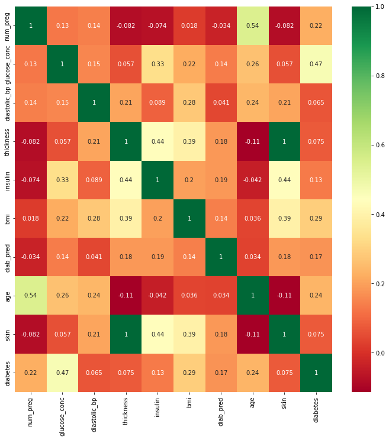

# Predecir diabtes

### Importar librerias


```python
import pandas as pd
import matplotlib.pyplot as plt
import numpy as np

%matplotlib inline
```


```python
data = pd.read_csv("diabetes.csv")
```


```python
data.shape
```


    (768, 10)


```python
data.head()
```


<div>
<style scoped>
    .dataframe tbody tr th:only-of-type {
        vertical-align: middle;
    }

    .dataframe tbody tr th {
        vertical-align: top;
    }

    .dataframe thead th {
        text-align: right;
    }
</style>
<table border="1" class="dataframe">
  <thead>
    <tr style="text-align: right;">
      <th></th>
      <th>num_preg</th>
      <th>glucose_conc</th>
      <th>diastolic_bp</th>
      <th>thickness</th>
      <th>insulin</th>
      <th>bmi</th>
      <th>diab_pred</th>
      <th>age</th>
      <th>skin</th>
      <th>diabetes</th>
    </tr>
  </thead>
  <tbody>
    <tr>
      <th>0</th>
      <td>6</td>
      <td>148</td>
      <td>72</td>
      <td>35</td>
      <td>0</td>
      <td>33.6</td>
      <td>0.627</td>
      <td>50</td>
      <td>1.3790</td>
      <td>True</td>
    </tr>
    <tr>
      <th>1</th>
      <td>1</td>
      <td>85</td>
      <td>66</td>
      <td>29</td>
      <td>0</td>
      <td>26.6</td>
      <td>0.351</td>
      <td>31</td>
      <td>1.1426</td>
      <td>False</td>
    </tr>
    <tr>
      <th>2</th>
      <td>8</td>
      <td>183</td>
      <td>64</td>
      <td>0</td>
      <td>0</td>
      <td>23.3</td>
      <td>0.672</td>
      <td>32</td>
      <td>0.0000</td>
      <td>True</td>
    </tr>
    <tr>
      <th>3</th>
      <td>1</td>
      <td>89</td>
      <td>66</td>
      <td>23</td>
      <td>94</td>
      <td>28.1</td>
      <td>0.167</td>
      <td>21</td>
      <td>0.9062</td>
      <td>False</td>
    </tr>
    <tr>
      <th>4</th>
      <td>0</td>
      <td>137</td>
      <td>40</td>
      <td>35</td>
      <td>168</td>
      <td>43.1</td>
      <td>2.288</td>
      <td>33</td>
      <td>1.3790</td>
      <td>True</td>
    </tr>
  </tbody>
</table>
</div>


```python
# check if any null value is present
data.isnull().values.any()
```


    False


```python
## Graficar la correlación entre las columnas
import seaborn as sns
import matplotlib.pyplot as plt
corrmat = data.corr()
top_corr_features = corrmat.index
plt.figure(figsize=(12,12))
#plot heat map
g=sns.heatmap(data[top_corr_features].corr(),annot=True,cmap="RdYlGn")
```


    

    


```python
data.corr()
```


<div>
<style scoped>
    .dataframe tbody tr th:only-of-type {
        vertical-align: middle;
    }

    .dataframe tbody tr th {
        vertical-align: top;
    }

    .dataframe thead th {
        text-align: right;
    }
</style>
<table border="1" class="dataframe">
  <thead>
    <tr style="text-align: right;">
      <th></th>
      <th>num_preg</th>
      <th>glucose_conc</th>
      <th>diastolic_bp</th>
      <th>thickness</th>
      <th>insulin</th>
      <th>bmi</th>
      <th>diab_pred</th>
      <th>age</th>
      <th>skin</th>
      <th>diabetes</th>
    </tr>
  </thead>
  <tbody>
    <tr>
      <th>num_preg</th>
      <td>1.000000</td>
      <td>0.129459</td>
      <td>0.141282</td>
      <td>-0.081672</td>
      <td>-0.073535</td>
      <td>0.017683</td>
      <td>-0.033523</td>
      <td>0.544341</td>
      <td>-0.081672</td>
      <td>0.221898</td>
    </tr>
    <tr>
      <th>glucose_conc</th>
      <td>0.129459</td>
      <td>1.000000</td>
      <td>0.152590</td>
      <td>0.057328</td>
      <td>0.331357</td>
      <td>0.221071</td>
      <td>0.137337</td>
      <td>0.263514</td>
      <td>0.057328</td>
      <td>0.466581</td>
    </tr>
    <tr>
      <th>diastolic_bp</th>
      <td>0.141282</td>
      <td>0.152590</td>
      <td>1.000000</td>
      <td>0.207371</td>
      <td>0.088933</td>
      <td>0.281805</td>
      <td>0.041265</td>
      <td>0.239528</td>
      <td>0.207371</td>
      <td>0.065068</td>
    </tr>
    <tr>
      <th>thickness</th>
      <td>-0.081672</td>
      <td>0.057328</td>
      <td>0.207371</td>
      <td>1.000000</td>
      <td>0.436783</td>
      <td>0.392573</td>
      <td>0.183928</td>
      <td>-0.113970</td>
      <td>1.000000</td>
      <td>0.074752</td>
    </tr>
    <tr>
      <th>insulin</th>
      <td>-0.073535</td>
      <td>0.331357</td>
      <td>0.088933</td>
      <td>0.436783</td>
      <td>1.000000</td>
      <td>0.197859</td>
      <td>0.185071</td>
      <td>-0.042163</td>
      <td>0.436783</td>
      <td>0.130548</td>
    </tr>
    <tr>
      <th>bmi</th>
      <td>0.017683</td>
      <td>0.221071</td>
      <td>0.281805</td>
      <td>0.392573</td>
      <td>0.197859</td>
      <td>1.000000</td>
      <td>0.140647</td>
      <td>0.036242</td>
      <td>0.392573</td>
      <td>0.292695</td>
    </tr>
    <tr>
      <th>diab_pred</th>
      <td>-0.033523</td>
      <td>0.137337</td>
      <td>0.041265</td>
      <td>0.183928</td>
      <td>0.185071</td>
      <td>0.140647</td>
      <td>1.000000</td>
      <td>0.033561</td>
      <td>0.183928</td>
      <td>0.173844</td>
    </tr>
    <tr>
      <th>age</th>
      <td>0.544341</td>
      <td>0.263514</td>
      <td>0.239528</td>
      <td>-0.113970</td>
      <td>-0.042163</td>
      <td>0.036242</td>
      <td>0.033561</td>
      <td>1.000000</td>
      <td>-0.113970</td>
      <td>0.238356</td>
    </tr>
    <tr>
      <th>skin</th>
      <td>-0.081672</td>
      <td>0.057328</td>
      <td>0.207371</td>
      <td>1.000000</td>
      <td>0.436783</td>
      <td>0.392573</td>
      <td>0.183928</td>
      <td>-0.113970</td>
      <td>1.000000</td>
      <td>0.074752</td>
    </tr>
    <tr>
      <th>diabetes</th>
      <td>0.221898</td>
      <td>0.466581</td>
      <td>0.065068</td>
      <td>0.074752</td>
      <td>0.130548</td>
      <td>0.292695</td>
      <td>0.173844</td>
      <td>0.238356</td>
      <td>0.074752</td>
      <td>1.000000</td>
    </tr>
  </tbody>
</table>
</div>


```python
# Cambiams la columna diabetes (true, false) por 1 ó 0.
diabetes_map = {True: 1, False: 0}
data['diabetes'] = data['diabetes'].map(diabetes_map)
```


```python
data.head()
```


<div>
<style scoped>
    .dataframe tbody tr th:only-of-type {
        vertical-align: middle;
    }

    .dataframe tbody tr th {
        vertical-align: top;
    }

    .dataframe thead th {
        text-align: right;
    }
</style>
<table border="1" class="dataframe">
  <thead>
    <tr style="text-align: right;">
      <th></th>
      <th>num_preg</th>
      <th>glucose_conc</th>
      <th>diastolic_bp</th>
      <th>thickness</th>
      <th>insulin</th>
      <th>bmi</th>
      <th>diab_pred</th>
      <th>age</th>
      <th>skin</th>
      <th>diabetes</th>
    </tr>
  </thead>
  <tbody>
    <tr>
      <th>0</th>
      <td>6</td>
      <td>148</td>
      <td>72</td>
      <td>35</td>
      <td>0</td>
      <td>33.6</td>
      <td>0.627</td>
      <td>50</td>
      <td>1.3790</td>
      <td>1</td>
    </tr>
    <tr>
      <th>1</th>
      <td>1</td>
      <td>85</td>
      <td>66</td>
      <td>29</td>
      <td>0</td>
      <td>26.6</td>
      <td>0.351</td>
      <td>31</td>
      <td>1.1426</td>
      <td>0</td>
    </tr>
    <tr>
      <th>2</th>
      <td>8</td>
      <td>183</td>
      <td>64</td>
      <td>0</td>
      <td>0</td>
      <td>23.3</td>
      <td>0.672</td>
      <td>32</td>
      <td>0.0000</td>
      <td>1</td>
    </tr>
    <tr>
      <th>3</th>
      <td>1</td>
      <td>89</td>
      <td>66</td>
      <td>23</td>
      <td>94</td>
      <td>28.1</td>
      <td>0.167</td>
      <td>21</td>
      <td>0.9062</td>
      <td>0</td>
    </tr>
    <tr>
      <th>4</th>
      <td>0</td>
      <td>137</td>
      <td>40</td>
      <td>35</td>
      <td>168</td>
      <td>43.1</td>
      <td>2.288</td>
      <td>33</td>
      <td>1.3790</td>
      <td>1</td>
    </tr>
  </tbody>
</table>
</div>


```python
# Imprimimos la cantidad de filas que tienen y no tienen diabetes. La suma debe dar 768.
diabetes_true_count = len(data.loc[data['diabetes'] == True])
diabetes_false_count = len(data.loc[data['diabetes'] == False])
(diabetes_true_count,diabetes_false_count)
```


    (268, 500)


```python
## Entrenamos el modelo.

from sklearn.model_selection import train_test_split
#feature_columns = ['num_preg', 'glucose_conc', 'diastolic_bp', 'insulin', 'bmi', 'diab_pred', 'age', 'skin']
feature_columns = ['num_preg', 'glucose_conc', 'bmi', 'age']
predicted_class = ['diabetes']
```


```python
X = data[feature_columns].values
y = data[predicted_class].values


X_train, X_test, y_train, y_test = train_test_split(X, y, test_size = 0.30, random_state=10)
```

Chequeamos que no haya valores en 0 en nuestro dataset. La cantidad de emabarazos sí puede conetener valores igual a 0.


```python
print("total number of rows : {0}".format(len(data)))
print("number of rows missing glucose_conc: {0}".format(len(data.loc[data['glucose_conc'] == 0])))
print("number of rows missing diastolic_bp: {0}".format(len(data.loc[data['diastolic_bp'] == 0])))
print("number of rows missing insulin: {0}".format(len(data.loc[data['insulin'] == 0])))
print("number of rows missing bmi: {0}".format(len(data.loc[data['bmi'] == 0])))
print("number of rows missing diab_pred: {0}".format(len(data.loc[data['diab_pred'] == 0])))
print("number of rows missing age: {0}".format(len(data.loc[data['age'] == 0])))
print("number of rows missing skin: {0}".format(len(data.loc[data['skin'] == 0])))
```

    total number of rows : 768
    number of rows missing glucose_conc: 5
    number of rows missing diastolic_bp: 35
    number of rows missing insulin: 374
    number of rows missing bmi: 11
    number of rows missing diab_pred: 0
    number of rows missing age: 0
    number of rows missing skin: 227
    


```python
# Si dejamos esos valores en 0 nuestra predicción se va a ver afectada negativamente.
# Vamos a reemplazar esos valores en 0 a través de la estrategia 'mean'. 'mean' saca una media de los demas valores.
from sklearn.impute import SimpleImputer

fill_values = SimpleImputer(missing_values=0, strategy="mean")

X_train = fill_values.fit_transform(X_train)
X_test = fill_values.fit_transform(X_test)
```


```python
print("total number of rows : {0}".format(len(data)))
print("number of rows missing glucose_conc: {0}".format(len(data.loc[data['glucose_conc'] == 0])))
print("number of rows missing diastolic_bp: {0}".format(len(data.loc[data['diastolic_bp'] == 0])))
print("number of rows missing insulin: {0}".format(len(data.loc[data['insulin'] == 0])))
print("number of rows missing bmi: {0}".format(len(data.loc[data['bmi'] == 0])))
print("number of rows missing diab_pred: {0}".format(len(data.loc[data['diab_pred'] == 0])))
print("number of rows missing age: {0}".format(len(data.loc[data['age'] == 0])))
print("number of rows missing skin: {0}".format(len(data.loc[data['skin'] == 0])))
```

    total number of rows : 768
    number of rows missing glucose_conc: 5
    number of rows missing diastolic_bp: 35
    number of rows missing insulin: 374
    number of rows missing bmi: 11
    number of rows missing diab_pred: 0
    number of rows missing age: 0
    number of rows missing skin: 227
    


```python
# Aplicamos el algoritmo RandomForest

from sklearn.ensemble import RandomForestClassifier
random_forest_model = RandomForestClassifier(random_state=10)

random_forest_model.fit(X_train, y_train.ravel())
```


    RandomForestClassifier(random_state=10)


```python
predict_train_data = random_forest_model.predict(X_test)

from sklearn import metrics

print("Accuracy = {0:.3f}".format(metrics.accuracy_score(y_test, predict_train_data)))
```

    Accuracy = 0.758
    


```python

```


```python

```
